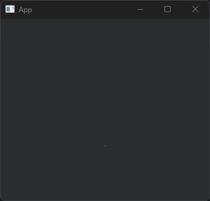

## 初期状態から一歩進める

さて，最初の`main.rs`の状態は以下となります．

```rust title="main.rs"
use bevy::prelude::*;

fn main() {
    App::new().run();
}
```

このままだとウィンドウも立ち上がらずに即時完了してしまいますね．
ウィンドウを起動させても真っ暗な状態ですので，物体を見るためのカメラ，そして地面を設置していきます．

最終的に`.exe`の形でビルドする方針で考えており，Web アセンブリ化する予定は今のところありません．

### 実装Ⅰ：ウィンドウの起動

以下の通り，コードを更新しました．
※import箇所は割愛

```rust ins={3-5, 9-15} title="main.rs" frame="code"
fn main() {
    App::new()
        .add_plugins(DefaultPlugins)
        .add_systems(Startup, setup)
        .add_systems(Update, hello_world)
        .run();
}

fn setup() {
    println!("setup");
}

fn hello_world() {
    println!("hello world");
}
```

スタートアップシステムに`setup`関数を，アップデートシステムに`hello_world`を設定しています．

実行コマンドは以下です．

```sh frame="code"
cargo run
```

筆者の環境[^1]の場合，このコード量でもビルドに約15 分程度要しました．

[^1]: PC スペックについては[こちら](/about)をご参照ください．

真っ黒のウィンドウが立ち上がり，ターミナルに大量の`hello world`が流れると成功です．
第一引数に`Update`を指定したシステムは毎フレーム繰り返します．
余計な処理になってしまうので`hello_world`は消しておきます．

ここで画面は準備できましたが，まだ空間に何もありません．
次の通り少しずつ実装していきます．

1. 物体をウィンドウに映すためのカメラをつくる
2. 自動販売機を設置するための地面をつくる

主人公の自動販売機の設置は次回に譲ります．

### 実装Ⅱ：カメラを追加する (Camera3DBundle)

カメラとライトを置きます．
それぞれのBundle を利用します．

Bundle とはコンポーネントの集合であると理解していますが，[Unofficeial Bevy Cheat Book](https://bevy-cheatbook.github.io/programming/bundle.html)さんの説明を引用しておきます．
> You can think of Bundles like "templates" or "blueprints" for creating entities. They make it easy to create entities with a common set of components.

```rust del={1-2} ins={3-17} title="main.rs > setup" frame="code"
fn setup() {
    println!("setup");
fn setup(mut commands: Commands) {
    commands.spawn(Camera3dBundle {
        transform: Transform::from_xyz(0.0, 6., 12.0).looking_at(Vec3::new(0., 1., 0.), Vec3::Y),
        ..default()
    });

    commands.spawn(PointLightBundle {
        point_light: PointLight {
            intensity: 5000.0,
            shadows_enabled: true,
            ..default()
        },
        transform: Transform::from_xyz(-3.0, 0.0, 10.0),
        ..default()
    });
}
```

できましたが，このままでも真っ暗のままですね．
地面を作りましょう．

### 実装Ⅲ：地面を追加する(PbrBundle)

販売機が路面を通過してしまわないように物理演算ライブラリ[bevy_xpbd](https://github.com/Jondolf/bevy_xpbd)を追加します．

```sh
cargo add bevy_xpbd_3d
```

そして路面追加用のシステムを新たに実装し，`App`に追加します．

```rust ins={4,8-23} title="main.rs" frame="code"
fn main() {
    App::new()
        .add_plugins(DefaultPlugins)
        .add_systems(Startup, (setup, create_road))
        .run();
}

fn create_road(
    mut commands: Commands,
    mut meshes: ResMut<Assets<Mesh>>,
    mut materials: ResMut<Assets<StandardMaterial>>,
) {
    commands.spawn((
        RigidBody::Static,
        Collider::cuboid(0.1, 0.002, 0.1),
        PbrBundle {
            mesh: meshes.add(shape::Plane::from_size(0.1).into()),
            material: materials.add(Color::SILVER.into()),
            transform: Transform::from_xyz(0., -1.5, 0.),
            ..default()
        },
    ));
}
```

このようにして作った路面がこちらです．
灰色の点として描画されています．
路面のサイズとカメラの位置が悪かったようです．



## Appendix

||Version|
|-|-|
|Rust|1.77 - nightly|
|Bevy|0.12.1|
|||

