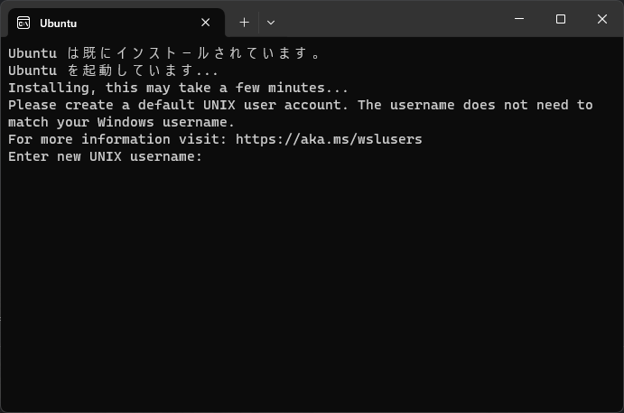
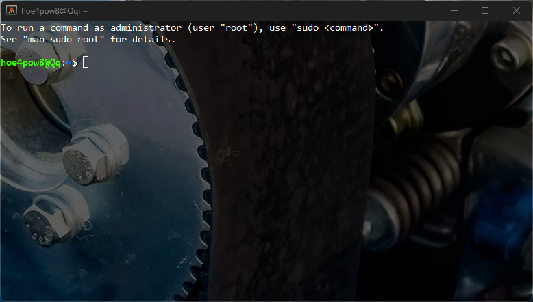
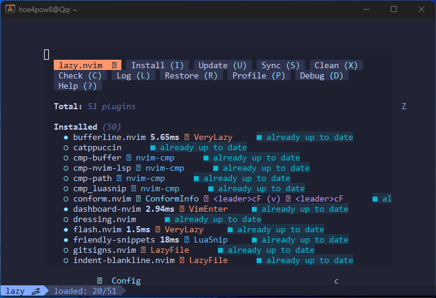
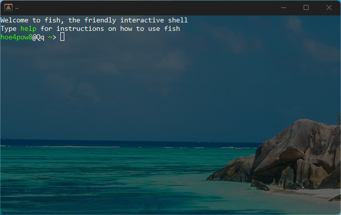
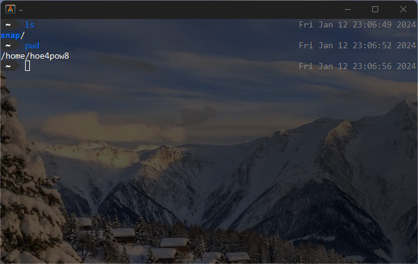

現在の開発環境を整えるためのメモを簡単に残しておきます．

## wsl2

管理者権限でPowerShell を開き，下記を実行します．
デフォルトで`Ubuntu`ディストリビューションがインストールされるようです．

```sh
wsl --install
```

```text
    PS C:\WINDOWS\system32> wsl --install
    インストール中: 仮想マシン プラットフォーム
    仮想マシン プラットフォーム はインストールされました。
    インストール中: Linux 用 Windows サブシステム
    Linux 用 Windows サブシステム はインストールされました。
    インストール中: Ubuntu
    Ubuntu はインストールされました。
    要求された操作は正常に終了しました。変更を有効にするには、システムを再起動する必要があります。
    PS C:\WINDOWS\system32>
```

成功しました．
再起動の指示に従います．

再起動から復帰すると，PowerShell がUbuntu を起動して待機していました．



ユーザ名とパスワードを設定するとプロンプトが返却され，完了です．
PowerShell は閉じます．

## ターミナル

Git Bash でもいいのですが，`Rust`製という出自がとてもCool なのでAlacritty をインストールします．

1. [Alacritty](https://alacritty.org/)をダウンロード
2. 下記の設定ファイルを作成

```toml title="~/AppData/Roaming/alacritty/alacritty.toml"
[mouse]
hide_when_typing = false

[[mouse.bindings]]
action = "Copy"
mods = "Shift"
mouse = "Left"

[[mouse.bindings]]
action = "Paste"
mods = "Shift"
mouse = "Right"

[shell]
program = "/Windows/System32/wsl.exe ~ -d Ubuntu"

[window]
opacity = 0.62
```

起動してみます．
背景に画像を適用させたわけではなく，Alacritty を透過させたためデスクトップ背景が見えているだけです．


管理者パスワードを設定します．

```sh
sudo su -
passwd
exit
```

おまじないのようにパッケージマネージャたちを更新させます．
Bevy エンジンを使うためのパッケージも入れます．

```sh
sudo snap refresh
sudo apt update
sudo apt install make lldb build-essential mold clang fontconfig lld libssl-dev libasound2-dev libudev-dev pkg-config
```

1 分くらいで終わるでしょう．
デフォルトエディタをついでに消しておきます．

```sh
sudo dpkg -P nano
```

## Rust

```sh
curl --proto '=https' --tlsv1.2 0sSf https://sh.rustup.rs | sh
```

> 1. Proceed with installation(default)

を選択すると10 秒ほどで以下が出力されます．

> stable-x86_64-unknown-linux-gnu installed - rustc 1.75.0 (82e1608df 2023-12-21)
> Rust is installed now. Great!
> To get started you may need to restart your current shell.
> This would reload your PATH environment variable to includ
> Cargo's bin directory ($HOME/.cargo/bin).
>
> To configure your current shell, run
> source "$HOME/.cargo/env"

ここも指示に従い，`source`コマンドで環境変数を再読み込みしておきます．

開発ツールも入れておきます．

```sh
rustup component add rustfmt
rustup component add clippy
rustup component add rls
rustup target add wasm32-unknown-unknown
cargo install wasm-server-runner
cargo install eza
```

## Neovim + LazyVim

エディタのインストールも簡単ですね．

```sh
sudo snap install --beta nvim --classic
git clone https://github.com/LazyVim/starter ~/.config/nvim
nvim
```



## fish

最後にシェルを変えましょう．

```sh
sudo apt-add-repository ppa:fish-shell/release-3
sudo apt update
sudo apt install fish
chsh -s $(which fish)
```

ターミナルを再起動するとチェンジシェルが有効になっています．


後は好みのテーマプラグインをインストールし，設定完了です．

```sh
curl https://raw.githubusercontent.com/oh-my-fish/oh-my-fish/master/bin/install | fish
omf install z
omf install bobthefish
```

`config_fish`コマンドも便利です．



## トラブルシューティング

Alacritty を閉じたあと再度Ubuntu を起動したとき，`cargo`コマンドが使えませんでした．

config.fish でパスを通しました．

```sh title="~/.config/fish/config.fish"
set --export PATH $HOME/.cargo/bin $PATH
```

## リポジトリ

<https://github.com/4hoe8pow/.dotfiles>
