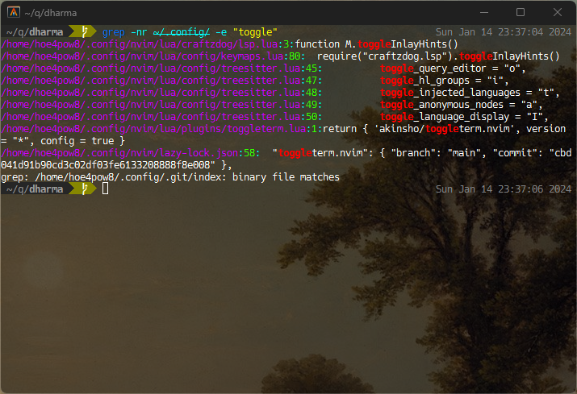

## 実行環境

- Ubuntu on WSL2

## コマンド

```sh
grep -rn ${path} -e ${text}
```

- `-r` : 再帰的にサブディレクトリ内を検索
- `-n` : マッチした行の前に行番号を表示
- ${path}: 検索を開始するディレクトリのパスを指定します。
- `-e` : 検索する文字列を指定

このコマンドを実行すると，指定したディレクトリとそのサブディレクトリ内のすべてのファイルで ${text} を含むファイルが一覧表示されます．
`-w`オプションもつけると，単語区切りで検索してくれます．

