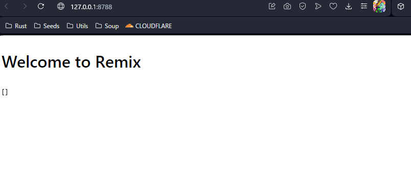
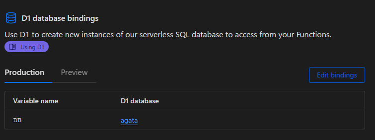

## Get Started

Remix とCloudflare のCDN ネットワークを組み合わせることにより，高速かつ安定したコンテンツの配信を享受することができます。
今回はCloudflare D1 + Drizzle ORMの構成でデータベースを構築します。

というわけで、以下のコマンドでプロジェクトを作成します。

```sh
pnpm create cloudflare@latest my-remix-app -- --framework=remix
```

## D1 データベースの作成

次に、以下のコマンドでローカルにD1 ができます。

```sh
npx wrangler d1 create ${DATABASE_NAME}
```

出力されたバインディング用の情報は、`wrangler.toml`を作成し、貼り付けます。

```toml title="wrangler.toml"
[[d1_databases]]
binding = "DB" # i.e. available in your Worker on env.DB
database_name = "foo"
database_id = "bar"
migrations_dir = "./app/db/migrations"
```

次に、マイグレーションへ移ります。
私は`app`ディレクトリの下に`db`ディレクトリを作成し、そこでスキーマを定義しました。

```sh
app
├── db
│  ├── client.server.ts
│  ├── schema
│  │  ├── match.ts
│  │  └── team.ts
│  └── schema.ts
├── entry.client.tsx
├── entry.server.tsx
├── root.tsx
└── routes
```

一旦適当に書きました。

```typescript
export const team = sqliteTable('team', {
    teamId: integer('teamId').primaryKey(),
    teamName: text('teamName').notNull(),
})
```

次に、以下のコマンドを実行するとマイグレーションファイルを作成してくれます。
※drizzle-kit は`pnpm add`しています。

```sh
pnpm drizzle-kit generate:sqlite
```

次に、ローカルD1 へマイグレーションを実施します。

```sh
npx wrangler d1 migrations apply ${DATABASE_NAME} --local
```

本番環境(Cloudflare)への適用は`--local`を外すだけです。

```sh
npx wrangler d1 migrations apply ${DATABASE_NAME}
```

D1データベースの作成が完了しました。

## データの取得

Remix でのサーバサイドの処理を書きます。

```typescript title="_index.tsx"
import { json } from '@remix-run/cloudflare'
import { useLoaderData } from '@remix-run/react'

import type { MetaFunction, LoaderFunction, LoaderFunctionArgs } from '@remix-run/cloudflare'

interface Env {
    // eslint-disable-next-line no-undef
    DB: D1Database
}

export const meta: MetaFunction = () => {
    return [{ title: 'New Remix App' }, { name: 'description', content: 'Welcome to Remix!' }]
}

export const loader: LoaderFunction = async ({ context, params }: LoaderFunctionArgs) => {
    let env = context.env as Env

    let { results } = await env.DB.prepare('SELECT * FROM team LIMIT 5').all()
    return json(results)
}

export default function Index() {
    const teams = useLoaderData<typeof loader>()
    return (
        <div >
            <h1>Welcome to Remix</h1>
            <pre>{JSON.stringify(teams)}</pre>
        </div>
    )
}

```

## ローカルでの開発

普通に`pnam dev`してlocalhost をブラウザで覗くとアプリケーションエラーになっていました。
どうやら、データベースとの接続に失敗していたようなので、調べてみるとローカルの場合はコマンドライン引数でバインディング引数を渡してあげる必要があるようです。

参考：<https://developers.cloudflare.com/d1/configuration/local-development/>

そのため、`package.json`を以下のように変更しました。

```sh
"start": "wrangler pages dev --compatibility-date=2024-02-13 ./public --d1 DB=${DATABASE_ID}",
```

その後、`pnpm dev`で正常に立ち上がってくれました。
（Insert などはしていないためデータはありません。）



## Cloudflare Pages へのデプロイ

GitHub リポジトリに`push`した後、Cloudflare 設定画面からリポジトリ連携すると、あっという間にデプロイが完了します。
ただし、本番環境では`wrangler.toml`は参照されないため、アプリケーションエラーが発生します。

設定画面の「Setting」タブに移動し、「D1 database bindings」から適切なバインディング変数を渡してあげましょう。



## 執筆時のパッケージ情報

|Package|ver|
|-|-|
|Remix|2.6.0|
|Drizzle|0.29.3|
|React|18.2.0|
|||

## 参考

<https://developers.cloudflare.com/pages/framework-guides/deploy-a-remix-site/>